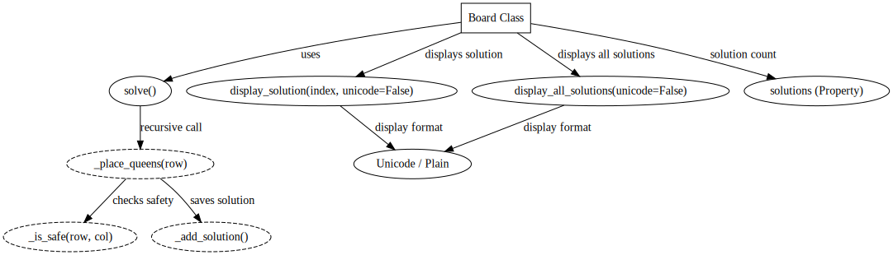

# Eight Queens Puzzle Solution - Abstract Data Types

This is a solution to the Eight Queens puzzle using the **Abstract Data Types (ADT)** approach in Python. The solution emphasizes encapsulation, modularity, and clear interfaces, ensuring an efficient and adaptable implementation of the problem.



*Figure 1: ADT Solution for 8 Queens Problem*


In the ADT approach (see Figure 1.), each component is encapsulated within a class or method to prevent external access and modification of internal states. The main `Board` class encapsulates all essential methods, including those for checking queen safety, placing queens, and displaying solutions, making it easy to modify or extend the code while ensuring consistent behavior.

## Overview

In the Eight Queens puzzle, the goal is to place eight queens on an 8x8 chessboard such that no two queens threaten each other (i.e., no two queens share the same row, column, or diagonal). This solution finds all possible configurations that meet this requirement.

### Key Components

1. **`Board` Class**: Represents the chessboard and manages queen placement, solution finding, and display operations.
2. **Encapsulated Helper Methods**:
   - `_is_safe`: Checks if placing a queen at a specific position is safe.
   - `_place_queens`: Recursively places queens across rows to find solutions.
   - `_add_solution`: Adds valid queen configurations to a solution list.
3. **Solution Display**: Offers options to display solutions using either a plain "Q" character or Unicode "♛" for a visual representation.

---

## Solution Architecture

The ADT-based design organizes the solution as follows:

### Methods and Properties

1. **`solve`**: Public method that initiates the process of finding all solutions by calling the recursive placement method.
2. **`display_solution`**: Displays a single solution by index, with options to use plain or Unicode representation.
3. **`display_all_solutions`**: Loops through and displays all found solutions.
4. **`solutions` (Property)**: Returns the number of solutions found.

### Encapsulation

All essential methods are encapsulated within the `Board` class, with private helper methods (prefixed with `_`) to restrict access, ensuring external code can only interact through the designated interface.

---

## Running the Solution

The solution is provided within a `Board` class. You can create a `Board` instance, call `solve`, and display solutions in either plain text or Unicode format.

### Example Code

```python
# Import and instantiate the Board
board = Board(8)

# Solve the Eight Queens puzzle
board.solve()

# Display all solutions with plain "Q" markers
board.display_all_solutions(unicode=False)

# Display all solutions with Unicode "♛" markers
board.display_all_solutions(unicode=True)
```

### Expected Output

Each solution is presented row-by-row with either "Q" or "♛" in columns where queens are placed, and "." for empty spaces.

Example:
```
...

Solution 63:

. . . . ♛ . . . 
. . . . . . . ♛ 
. . . ♛ . . . . 
♛ . . . . . . . 
. . ♛ . . . . . 
. . . . . ♛ . . 
. ♛ . . . . . . 
. . . . . . ♛ . 

...
```


---

## Analysis of the ADT Solution

Below is a comparison of the Abstract Data Types approach with alternative architectures: **Pipes and Filters** and **Shared Data**.

| **Criteria**                               | **Abstract Data Types (ADT)**         | **Pipes and Filters**                    | **Shared Data**                         |
|--------------------------------------------|---------------------------------------|------------------------------------------|-----------------------------------------|
| **Encapsulation**                          | High: Clear interfaces and restricted access | Moderate: Each filter is independent but communicates with others. | Low: Shared state makes encapsulation difficult. |
| **Modularity**                             | High: Methods for each specific task ensure modularity | High: Separate filters act as modular components | Low: Modules interact with shared data directly. |
| **Reusability**                            | High: Encapsulated components can be reused | High: Independent filters are reusable in different contexts | Low: Modules are interdependent and difficult to isolate. |
| **Ease of Extension**                      | Moderate: New features may require changes in class methods | High: Easily add new filters to the pipeline | Low: Difficult to modify due to shared data dependencies. |
| **Performance**                            | High: Direct data access improves speed | Moderate: Pipeline introduces communication overhead | High: Direct shared data access can boost speed. |

### Justification for Using ADT

1. **Encapsulation**: The ADT approach ensures strong encapsulation, protecting the board’s internal states and ensuring only designated methods interact with the class’s attributes.
2. **Ease of Modification**: As methods and attributes are isolated, changes to one part of the program won’t affect others, making it ideal for complex problems like Eight Queens where specific behaviors are encapsulated.
3. **Flexibility**: ADT ensures each component, such as queen placement or safety checks, can be updated without interfering with others.

### Opinion

The ADT approach is highly suited to the 8Q problem due to its encapsulated structure and clear interface, making it easy to manage complex constraints within the problem. The encapsulated design promotes reusability, modularity, and straightforward debugging, which align well with maintainable and adaptable code standards.  While ADTs excel in encapsulation and modularity, Main/Subroutine with Shared Data provides a clear, procedural flow but risks coupling, and Pipes and Filters support modularity in distributed setups at the cost of overhead. Event-Driven approaches enable interactive solutions but add complexity in managing events for accurate puzzle resolution. 

---

## References

1. Garlan, D., & Shaw, M. (1993). *An Introduction to Software Architecture*, https://doi.org/10.1142/9789812798039_0001
2. Wikipedia contributors. (2024, September 22). Eight queens puzzle. Wikipedia., https://en.wikipedia.org/wiki/Eight_queens_puzzle