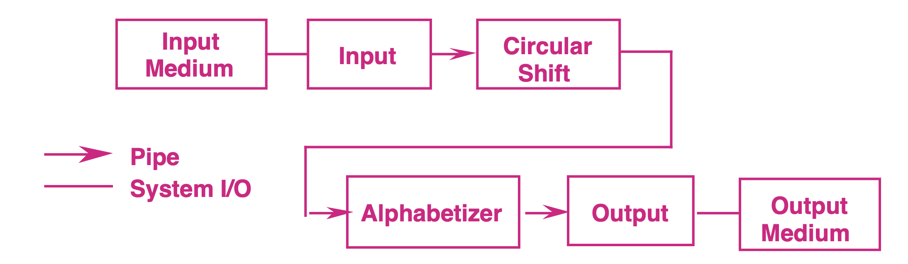

# KWIC Index Solution - Pipes and Filters Architecture

This repository contains a KWIC (Key Word in Context) solution implemented in python3, using the **Pipes and Filters architecture**. Each stage in the KWIC process (input, shifting, sorting, and output) is implemented as an independent module, which allows for flexible and modular processing.



*Figure 1: Pipe and Filter Solution for KWIC [1]*

The solution implements a pipeline approach with four filters: input, shift, alphabetize, and output. Each filter independently processes data and passes it to the next filter in the sequence. Control is distributed, meaning that each filter activates as soon as it receives data, and the only shared data is that which flows through the pipes between filters (refer to Figure 1 for a visual representation from An Introduction to Software Architecture by Garlan & Shaw).

This design offers several advantages. It maintains a clear and logical flow, making the processing steps intuitive. Each filter is isolated, which supports reuse as long as upstream filters provide data in a compatible format. This modularity also makes it easy to add new functions simply by inserting new filters in the appropriate position in the pipeline. Additionally, the independence of filters simplifies modifications, as changes in one filter do not impact others.

However, there are some limitations. This pipeline structure is not well-suited for interactive systems, as it lacks a mechanism for persistent data storage—necessary, for instance, if a user needed to delete a line. Adding such storage would break the core design principle of isolation between filters. Additionally, this solution can be space-inefficient, as each filter must copy all data to its output, increasing memory usage.

## Overview

The KWIC solution utilizes four filters:
1. **`input_filter.py`**: Prepares input titles for processing.
2. **`shift_filter.py`**: Performs circular shifts on each title.
3. **`alphabetize_filter.py`**: Alphabetically sorts the shifted titles based on keywords.
4. **`output_filter.py`**: Outputs the formatted KWIC index, with an optional `--pretty` flag for aligned output.

This approach is based on the architectural principles described by Garlan and Shaw in *An Introduction to Software Architecture*, focusing on modular, maintainable code that can be easily adapted for different requirements.

---

## Running the Solution

### Method 1: Running as Separate Scripts (True Pipes and Filters)

To run each module as a distinct script, use a series of `pipes` in the command line. This setup showcases the true Pipes and Filters style, where each module operates independently.

```bash
# Run with plain text output
python3 input_filter.py "Design Patterns and Software Architecture" \
                       "Introduction to Advanced Computing" \
                       "Principles of Software Engineering" \
                       "Software Design for Performance" | \
python3 shift_filter.py | \
python3 alphabetize_filter.py | \
python3 output_filter.py

# Run with formatted output using the --pretty flag
python3 input_filter.py "Design Patterns and Software Architecture" \
                       "Introduction to Advanced Computing" \
                       "Principles of Software Engineering" \
                       "Software Design for Performance" | \
python3 shift_filter.py | \
python3 alphabetize_filter.py | \
python3 output_filter.py --pretty
```

### Method 2: Running through `main.py`

For ease of use, you can run the solution using `main.py`, which orchestrates the scripts internally. This method achieves the same output while simplifying the command.

```bash
# Run with plain text output
python3 main.py

# Run with formatted output using the --pretty flag
python3 main.py --pretty
```

---

### Example input:

```bash
python3 input_filter.py "Design Patterns and Software Architecture and some other words" \
                       "Introduction to Advanced Computing is nice and quite long and has a lot of words" \
                       "Principles of Software Engineering" \
                       "this one is shorter" \
                       "Software Design for Performance" \
                       "Hello World" \
                       "A Quick Guide to python3 Programming" \
                       "Advanced Topics in Machine Learning" \
                       "Web Development with Flask and Django" \
                       "An Exploration of Data Structures" \
                       "Understanding Algorithms and Complexity" \
                       "Creating User Interfaces with React" \
                       "The Art of Software Testing" \
                       "Effective Communication in Software Teams" \
                       "Building Scalable Applications in the Cloud" \
                       "Introduction to Cybersecurity Best Practices" \
                       "Optimizing Database Performance for Large Systems" | \
python3 shift_filter.py | \
python3 alphabetize_filter.py | \
python3 output_filter.py --pretty
```


### Example Output (with `--pretty` flag)

```
Pre Words                                           | Keyword       | Post Words
-------------------------------------------------------------------------------
                                       Introduction | Advanced      | Computing nice quite long lot words
                                                    | Advanced      | Topics Machine Learning
                                      Understanding | Algorithms    | Complexity
                                  Building Scalable | Applications  | Cloud
                           Design Patterns Software | Architecture  | words
                                                    | Art           | Software Testing
                         Introduction Cybersecurity | Best          | Practices
                                                    | Building      | Scalable Applications Cloud
                     Building Scalable Applications | Cloud         | 
                                          Effective | Communication | Software Teams
                           Understanding Algorithms | Complexity    | 
                              Introduction Advanced | Computing     | nice quite long lot words
                                                    | Creating      | User Interfaces React
                                       Introduction | Cybersecurity | Best Practices
                                        Exploration | Data          | Structures
                                                           ...
```
(first 15 lines)


### Plain Text Output (no `--pretty` flag)

```
Introduction Advanced Computing nice quite long lot words
Advanced Topics Machine Learning
Understanding Algorithms Complexity
Building Scalable Applications Cloud
Design Patterns Software Architecture words
Art Software Testing
Introduction Cybersecurity Best Practices
Building Scalable Applications Cloud
Building Scalable Applications Cloud
Effective Communication Software Teams
Understanding Algorithms Complexity
Introduction Advanced Computing nice quite long lot words
Creating User Interfaces React
Introduction Cybersecurity Best Practices
Exploration Data Structures
```

(first 15 lines)


---

## Comparison of Different KWIC Architectures

Below is a comparison of our Pipes and Filters approach with alternative architectures: **Abstract Data Type** and **Shared Data**.

| **Criteria**                               | **Pipes and Filters** | **Abstract Data Type**                          | **Shared Data**                              |
|--------------------------------------------|--------------------------------------|-------------------------------------------------|----------------------------------------------|
| **Algorithm Flexibility**                  | High: Easily replace or reorder modules by modifying the pipeline. | Moderate: Requires changing method definitions but retains modularity. | Low: Processing algorithm is coupled with data access. |
| **Ease of Changing Data Representation**   | Moderate: Data representation is limited by the format sent through pipes. | High: Encapsulation allows easy changes to internal data representation. | Low: Changes to shared data are complex due to module interdependence. |
| **Adding New Functions**                   | High: Easily add new filters to the pipeline without impacting existing modules. | Moderate: New functions require updating existing classes. | High: Adding functions is relatively simple since all modules access shared data. |
| **Performance**                            | Moderate: Pipe-based communication may introduce minor overhead. | High: Direct interactions without inter-process communication enhance speed. | High: Direct data access avoids inter-process communication. |
| **Reusability**                            | High: Independent filters can be reused across different projects. | High: Encapsulated modules can be reused. | Low: Module interdependence reduces reusability. |


### Analysis and Justification

1. **Algorithm Flexibility**: The Pipes and Filters solution is inherently flexible, supporting changes to the processing sequence by rearranging or replacing filters within the pipeline, a significant advantage over other methods.

2. **Data Representation**: The Abstract Data Type solution is most conducive to changes in data representation due to its encapsulation, whereas Pipes and Filters have moderate flexibility as the data format must fit the pipeline protocol.

3. **Adding New Functions**: The Pipes and Filters approach is highly extensible, as new filters can be introduced without significant refactoring. Shared Data also supports adding functions with relative ease, though it comes at the cost of inter-module dependency.

4. **Performance**: Shared Data and Abstract Data Type methods may outperform Pipes and Filters in data-intensive applications, as pipes introduce some overhead. However, the trade-off is worthwhile for maintainability in projects where performance is not the sole priority.

5. **Reusability**: Each filter in Pipes and Filters is independent, making this approach the most reusable. Abstract Data Types also have strong reusability but with less flexibility in changing the sequence or type of operations.

### Opinion and considerations
For a similar project, I would choose the Pipes and Filters architecture for its balance of modularity, ease of extension, and maintainability. Despite minor performance drawbacks, the clear separation of tasks allows for simpler debugging, testing, and future modifications compared to the other methods. 

In building the KWIC system, I opted for a process-based approach using pipes, rather than a thread-and-queue method. This decision better aligns with both the project’s requirements and the principles of the Pipes and Filters architecture, particularly due to its Unix-like modular design.

Each filter (input, shift, alphabetize, output) operates as an isolated process, making it truly modular and self-contained. This means each component runs independently, with separate memory spaces, ensuring no unintended side effects. Each filter is effectively a “black box” that can be tested, modified, or replaced without impacting others. In contrast, a threading approach would involve shared memory, leading to tighter coupling and potential interference between components.

This approach also supports distributed control. Each process-based filter runs independently, only acting when data is received. The components work together without needing direct control or awareness of each other, allowing for flexibility and adaptability. While threads can achieve a level of independence, they would share a single memory space, making this structure less pure architecturally.

Furthermore, this process-based model follows the Unix philosophy, which emphasizes chaining simple, single-purpose programs. Each filter reads from standard input and writes to standard output, just like a Unix pipeline, which makes testing, debugging, and replacing components simple and seamless.

Additionally, separate processes can run in parallel across CPU cores, which is beneficial for a data-processing pipeline like KWIC. python3's threading is often limited by the Global Interpreter Lock (GIL), so true parallelism can be difficult to achieve with threads. This process-based design, however, allows for efficient handling of inputs and can scale well.

In conclusion, this approach closely matches the Pipes and Filters architecture. The process-based design maintains modularity, isolation, and flexibility, which aligns well with Unix-inspired principles, keeping each filter independent, reusable, and easy to modify.


# References
1. Garlan, D., & Shaw, M. (1993). AN INTRODUCTION TO SOFTWARE ARCHITECTURE., https://doi.org/10.1142/9789812798039_0001
2. Wikipedia contributors. (2024, August 12). Key word in context. Wikipedia., https://en.wikipedia.org/wiki/Key_Word_in_Context